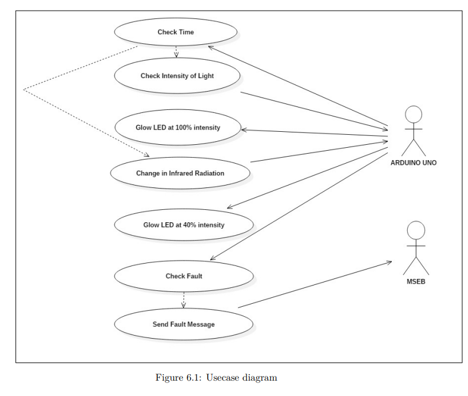
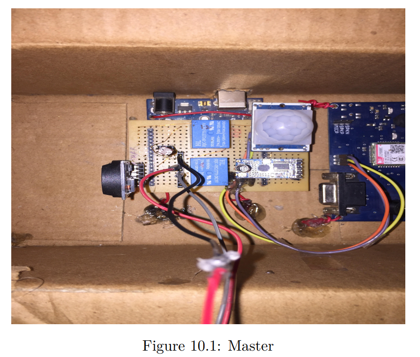
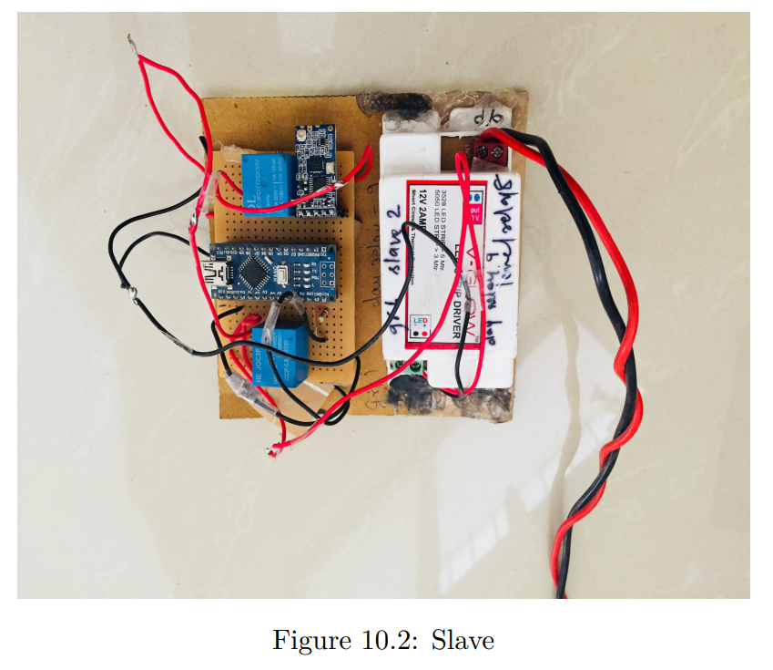
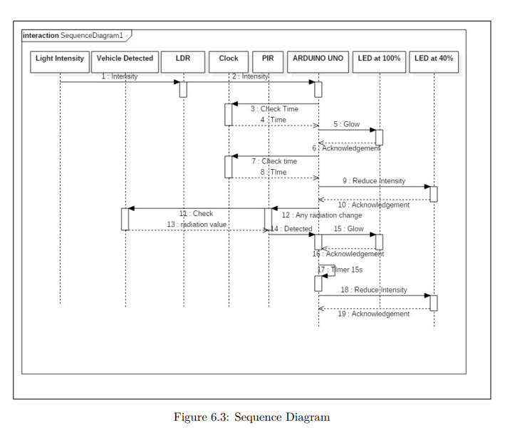
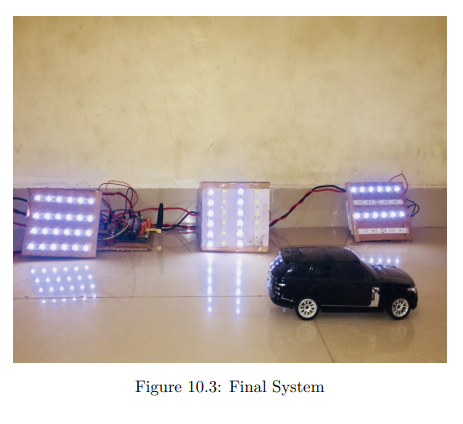

# Embedded Smart Street Light System

## Overview

The **Embedded Smart Street Light System** is a smart energy-efficient lighting solution designed to automate street light operation based on ambient light and motion detection. The system uses **LDR** and **PIR sensors** to dynamically control light intensity and employs **GSM-based fault detection** to enhance maintainability.

Developed using **Arduino-based microcontrollers**, this system helps reduce energy consumption, lower CO₂ emissions, and streamline maintenance processes for urban and rural street lighting infrastructure.

---

## Features

✅ Automated lighting using ambient and motion sensors\
✅ Fault detection via GSM alerts\
✅ Power-efficient LED usage with dimming control\
✅ Real-time clock (RTC) based time-sensitive behavior\
✅ Wireless communication between poles (HC-12 module)\
✅ Works on PWM (Pulse Width Modulation) for intensity control

---

## Problem Statement

Traditional street lights waste significant electricity by operating at full intensity all night. This project addresses that problem by:

- Automating light activation based on motion and light levels
- Reducing intensity in the absence of motion
- Detecting faulty lights for timely maintenance
- Saving power through LED-based dimming

---

## Goals and Objectives

- Reduce electricity consumption by 50% or more
- Implement fault detection for maintenance alerts
- Decrease operational and maintenance costs
- Reduce CO₂ emissions by replacing sodium lamps with LEDs
- Increase system lifespan with reliable embedded hardware

---

## System Architecture


*Figure: Use Case Diagram of the Smart Street Light System*


*Figure: Master Node*


*Figure: Slave Node*

- **LDR Sensor**: Detects ambient light and triggers night mode
- **PIR Sensor**: Detects motion to activate full brightness
- **GSM Module**: Sends alerts if a streetlight fails
- **RTC Module**: Ensures time-bound activation and dimming
- **HC-12 Modules**: Enable master-slave communication
- **PWM**: Used to modulate LED brightness (100% / 50%)

---

## Algorithm Workflow


*Figure: Sequence Diagram of the System Workflow*

```text
1. LDR checks for ambient light after 6PM
2. If low light, LED turns on and notifies slave lights
3. After 11PM, default brightness = 50%
4. PIR detects motion:
   - If detected, brightness = 100% temporarily
5. Faulty lights are detected via LDR-GSM logic
6. At 6AM, all lights turn off and reset
```

---

## Tools & Technologies Used

- **Arduino UNO & Nano**
- **GSM Module**
- **HC-12 Wireless Serial Module**
- **RTC DS1307**
- **PIR Sensor**
- **LDR Sensor**
- **LEDs**
- **Arduino IDE (C/C++)**

---

## Challenges & Mitigations

- 📶 **Wireless signal range**: Solved using HC-12 with better transmission
- ⚡ **Sensor accuracy**: Careful installation to avoid false triggers
- 🔌 **Power interruptions**: Accounted with robust circuit design and RTC

---

## Conclusion



*Figure: Final Prototype of the Smart Street Light System*

The project successfully demonstrates a scalable, cost-efficient street lighting solution. It has the potential to be deployed in smart cities, highways, and residential areas, significantly reducing energy usage and improving maintenance through automation and embedded control systems.

---

## Future Enhancements

- Solar panel integration for energy independence
- Mobile app for live status and control
- AI-based traffic pattern prediction for adaptive lighting
- Cloud-based analytics and fault tracking
