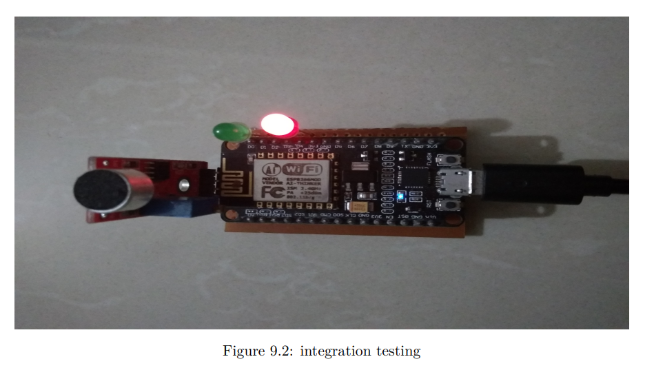
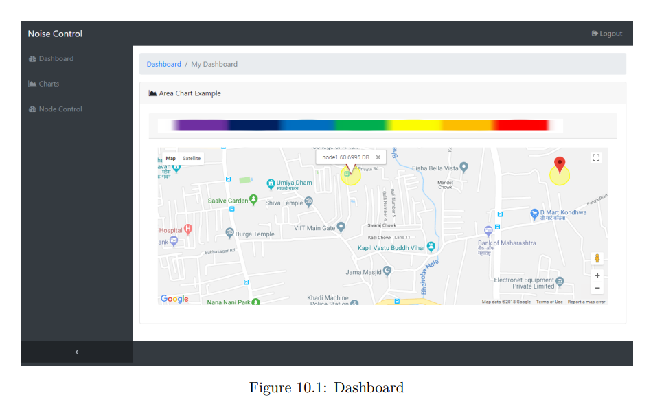
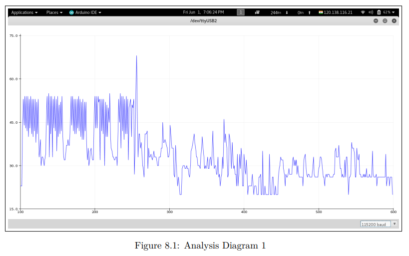
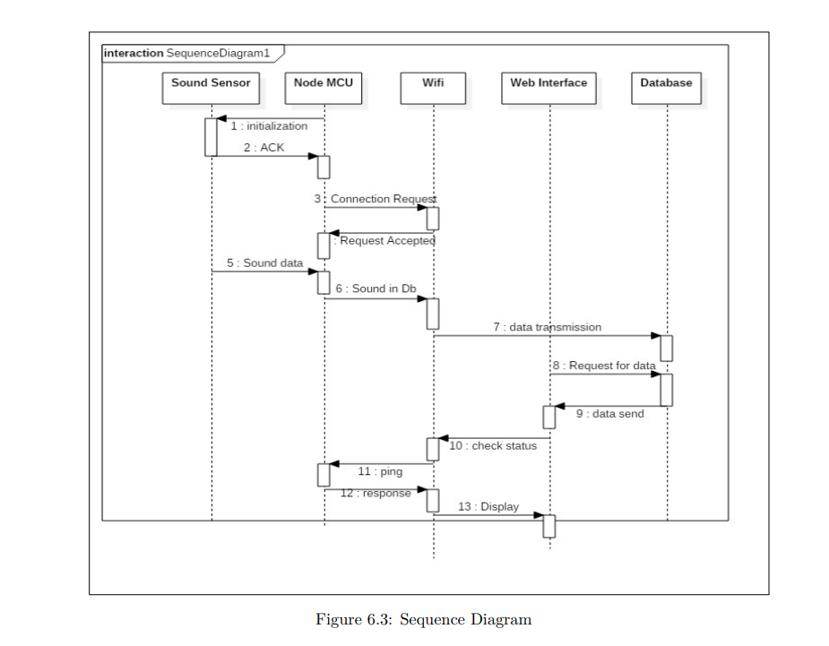

# Smart City Noise Detection

## Overview
A system designed to monitor and manage noise pollution in urban environments. It detects sound levels using sensors and captures photographic evidence when noise exceeds a defined threshold. Data is uploaded to Firebase for real-time monitoring.

## Goals
- Detect and monitor city-wide noise pollution
- Automate enforcement in restricted zones
- Identify suitable areas for sensitive buildings like hospitals

## Technology Stack
- Node MCU
- Analog sound sensor
- Firebase Realtime Database
- Camera Module
- Web Dashboard (PHP, Firebase integration)

*Figure: Example of a deployed sensor node*

## Features
- Real-time decibel detection and logging
- Automatic camera capture and alerting on threshold breach
- Dashboard for city-wide node visualization
- Historical noise data analysis

*Figure: Dashboard showing node locations across the city and its noise levels*

*Figure: Real-time noise data visualization on the dashboard*

*Figure: Raw noise data from sound sensor*

## Architecture
1. Sound sensor detects decibel levels
2. If above threshold, triggers:
   - Warning
   - Camera capture
   - Data upload to Firebase
3. Dashboard visualizes data and node locations

*Figure: System sequence diagram*

## Tools Used
- Arduino IDE
- Apache server (000webhost)
- Firebase
- Gedit (Linux)

## Outcome
Helps authorities monitor noise zones without physical presence. Can influence urban planning decisions and reduce city noise pollution.

## Future Scope
- Integration with ML to predict noise patterns
- Mobile app alerts
- Expanded to monitor air quality

